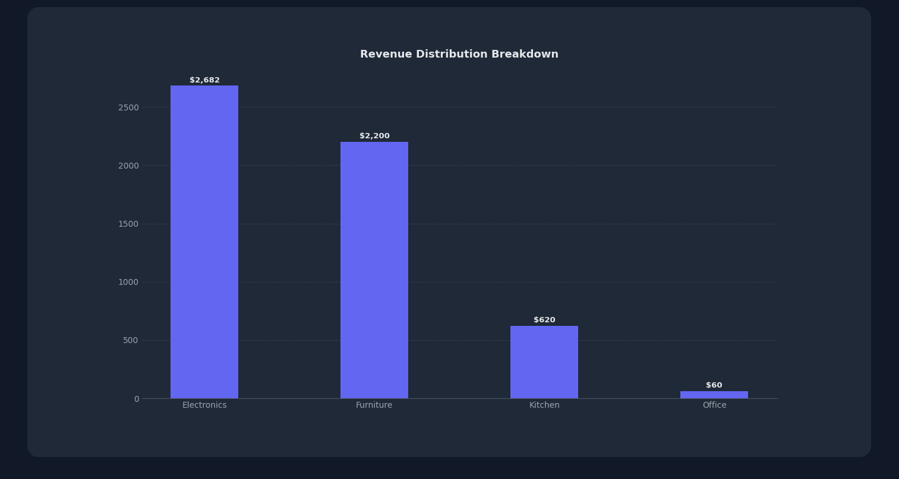

# Sales Analytics Dashboard

A desktop-based sales analytics dashboard built with **Python, MySQL, CustomTkinter, and Matplotlib**. The application provides sales and business insights through interactive visualizations, KPI monitoring, and data analysis.

## Features

* Real-time sales performance tracking
* Revenue and profit analytics
* Customer and product performance insights
* Interactive data visualizations
* MySQL-powered relational database backend
* Desktop user interface
* Modular and scalable architecture

## Technology Stack

| Category             | Technologies  |
| -------------------- | ------------- |
| Programming Language | Python 3.12+  |
| Database             | MySQL         |
| GUI Framework        | CustomTkinter |
| Data Analysis        | Pandas        |
| Data Visualization   | Matplotlib    |
| Version Control      | Git           |

## Project Structure

```text
SalesAnalyticsDashboard/
│
├── data/
│
├── database/
│   └── schema.sql
│
├── src/
│   ├── db.py
│   ├── analytics.py
│   └── dashboard.py
│
├── test_connection.py
├── requirements.txt
├── README.md
└── .gitignore
```

## Key Business Metrics

The dashboard provides the following metrics and analysis:

| Metric               | Description                         |
| -------------------- | ----------------------------------- |
| Total Revenue        | Overall revenue generated           |
| Product Performance  | Best and worst performing products  |
| Customer Analytics   | Customer purchase behavior          |
| Sales Trends         | Monthly and yearly growth analysis  |
| KPI Tracking         | Key business performance indicators |
| Revenue Distribution | Category-wise sales analysis        |

## Dashboard Capabilities

* Analyze sales trends over time
* Monitor customer purchasing patterns
* Identify top-performing products
* Visualize revenue distribution
* Generate business intelligence reports
* Support business decision-making through data analysis

## How to Run

### Prerequisites

Make sure you have the following installed:

* Python 3.12 or later
* MySQL
* Git

### 1. Clone the Repository

```bash id="e7q0jv"
git clone https://github.com/your-username/SalesAnalyticsDashboard.git
cd SalesAnalyticsDashboard
```

### 2. Create a Virtual Environment

```bash id="jq4t8x"
python -m venv venv
```

### 3. Activate the Virtual Environment

**Windows:**

```bash id="k1q4sy"
venv\Scripts\activate
```

### 4. Install Dependencies

```bash id="l5sp3r"
pip install -r requirements.txt
```

## Database Setup

### 1. Create the Database

Open MySQL and create the database:

```sql id="3k1c7p"
CREATE DATABASE sales_dashboard;
```

### 2. Execute the Schema

Run the schema file to create the required database structure:

```sql id="4m6q9x"
SOURCE database/schema.sql;
```

Make sure the MySQL connection details used by the application are configured correctly before running the dashboard.

## Run the Application

Start the dashboard with:

```bash id="n8j2hf"
python src/dashboard.py
```

## Screenshots

### Dashboard Overview

The dashboard provides KPI monitoring, revenue tracking, item sales metrics, and category performance.


### Revenue Distribution Analysis

The revenue chart provides a category-wise breakdown of sales generated from transactions.



## Learning Outcomes

This project demonstrates practical experience with:

* Database design and SQL querying
* Data analysis with Pandas
* Business intelligence reporting
* Data visualization
* Desktop application development
* Modular software architecture
* Version control with Git

## Author

**Saksham Yadav**

B.Tech Computer Science Engineering

India

Aspiring Software Engineer | Data Analytics Enthusiast
