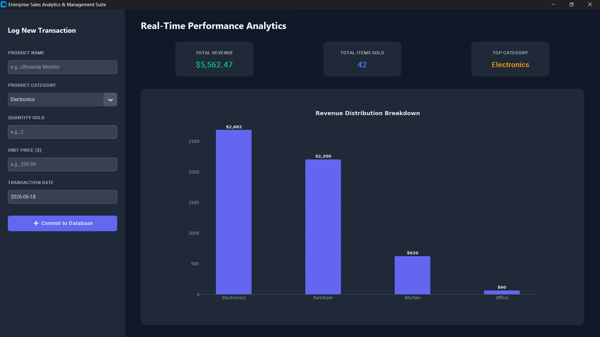

# 📊 Sales Analytics Dashboard

A modern desktop-based Sales Analytics Dashboard built with **Python**, **MySQL**, **CustomTkinter**, and **Matplotlib**. The application provides real-time business insights through interactive visualizations, KPI monitoring, and data-driven reporting to support informed decision-making.

---

## 🚀 Features

✅ Real-time sales performance tracking

✅ Revenue and profit analytics

✅ Customer and product performance insights

✅ Interactive data visualizations

✅ MySQL-powered relational database backend

✅ Modern desktop user interface

✅ Modular and scalable architecture

---

## 🛠️ Technology Stack

| Category             | Technologies  |
| -------------------- | ------------- |
| Programming Language | Python 3.12+  |
| Database             | MySQL         |
| GUI Framework        | CustomTkinter |
| Data Analysis        | Pandas        |
| Data Visualization   | Matplotlib    |
| Version Control      | Git           |

---

## 📂 Project Structure

```text
SalesAnalyticsDashboard/
│
├── data/
│
├── database/
│   └── schema.sql
│
├── src/
│   ├── db.py
│   ├── analytics.py
│   └── dashboard.py
│
├── test_connection.py
├── requirements.txt
├── README.md
└── .gitignore
```

---

## 📈 Key Business Metrics

The dashboard is designed to provide actionable insights through:

| Metric                  | Description                         |
| ----------------------- | ----------------------------------- |
| 💰 Total Revenue        | Overall revenue generated           |
| 📦 Product Performance  | Best and worst performing products  |
| 👥 Customer Analytics   | Customer purchase behavior          |
| 📊 Sales Trends         | Monthly and yearly growth analysis  |
| 🎯 KPI Tracking         | Key business performance indicators |
| 📉 Revenue Distribution | Category-wise sales analysis        |

---

## 🔍 Dashboard Capabilities

* Analyze sales trends over time
* Monitor customer purchasing patterns
* Identify top-performing products
* Visualize revenue distribution
* Generate business intelligence reports
* Support strategic decision-making through data insights

---

## ⚙️ Installation

### 1️⃣ Clone Repository

```bash
git clone https://github.com/your-username/SalesAnalyticsDashboard.git
cd SalesAnalyticsDashboard
```

### 2️⃣ Create Virtual Environment

```bash
python -m venv venv
```

### 3️⃣ Activate Environment

**Windows**

```bash
venv\Scripts\activate
```

### 4️⃣ Install Dependencies

```bash
pip install -r requirements.txt
```

---

## 🗄️ Database Setup

Create a MySQL database:

```sql
CREATE DATABASE sales_dashboard;
```

Execute the schema file:

```sql
SOURCE database/schema.sql;
```

---

## ▶️ Run the Application

```bash
python src/dashboard.py
```

---

## 🎓 Learning Outcomes

This project demonstrates practical experience in:

* Database Design & SQL Querying
* Data Analytics with Pandas
* Business Intelligence Reporting
* Data Visualization Techniques
* Desktop Application Development
* Software Architecture & Modular Design
* Version Control with Git

---
## 📸 Application Screenshots

### 🏠 Dashboard Overview

Real-time KPI monitoring including revenue tracking, item sales metrics, and category performance.



### 📊 Revenue Distribution Analysis

Visual breakdown of category-wise revenue generated from sales transactions.


## 👨‍💻 Author

**Saksham Yadav**

B.Tech Computer Science Engineering

📍 India

💼 Aspiring Software Engineer | Data Analytics Enthusiast
